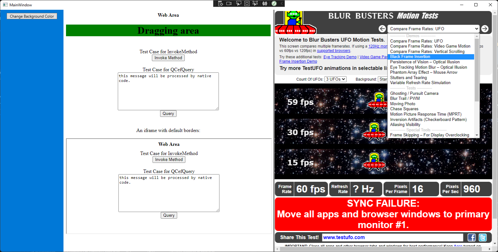

# DNCefView

C# wrapper of CefView for .NET environment

# Roadmap

- CCefViwe: A C wrapper of CefView. This project output a binary/resource set used by high level language bindings. It only expose C interface. I believe this project can be used in any C/C++ environment like Unity/Godot/Unreal.

- DNCef: A C# binding of CCefView for .NET environment

- DNCef.WPF: An implementation of DNCef targeting Windows Presentation Foundation

- DNCef.Unity? Not implemented and no certain timing to do this. Because Unity Engine is too complex to include CEF at runtime, for stability reason, need to move the architecture to a total external process, like ZFBrowser.

- DNCef.Godot? Maybe same solution as the DNCef.Unity

#
