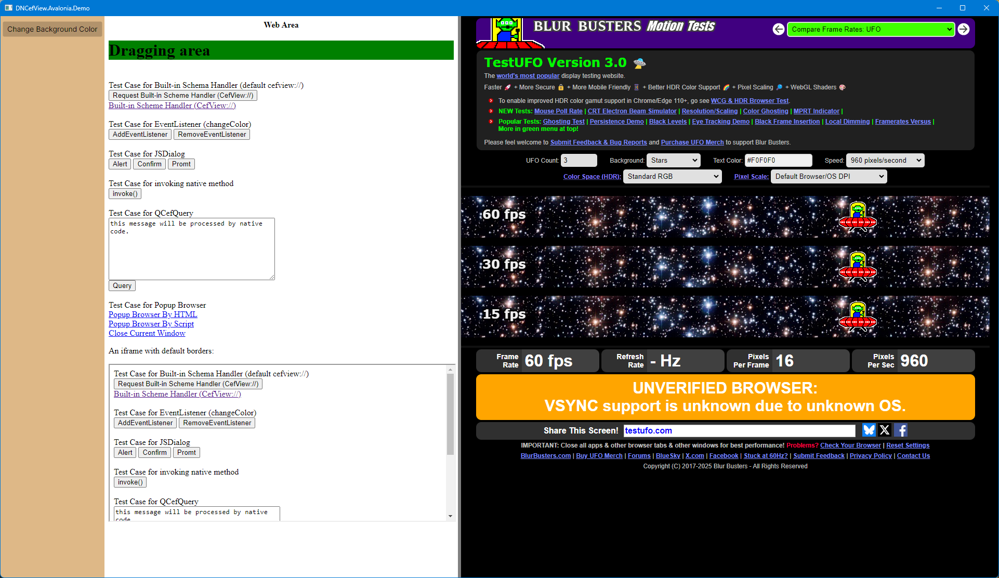
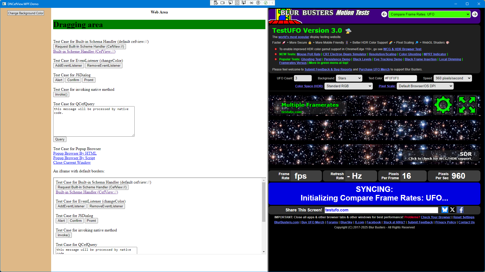

# DNCefView

[](https://github.com/CefView/DNCefView/actions)
[](https://www.nuget.org/packages/DNCefView/)
[](LICENSE)

An encapsulation of CefView for the .NET stack, providing lightweight Chromium-based browser controls for WPF and Avalonia applications.

| Avalonia | WPF |
|:---:|:---:|
|  |  |

## Introduction

DNCefView is a .NET wrapper for [CefView](https://github.com/CefView), which itself is a lightweight wrapper around the powerful [Chromium Embedded Framework (CEF)](https://bitbucket.org/chromiumembedded/cef).

With DNCefView, you can embed a modern, high-performance web browser component directly into your .NET desktop applications. This allows you to build rich user interfaces using web technologies (HTML, CSS, JavaScript) or simply display web content within your native WPF or Avalonia applications.

## Features

*   **Lightweight:** A minimal wrapper to keep things simple and fast.
*   **Modern Web Standards:** Powered by Chromium, ensuring compatibility with the latest web technologies.
*   **.NET 8 Support:** Built for the latest version of .NET.
*   **WPF Integration:** Provides a `CefView` control for seamless integration into your Windows Presentation Foundation (WPF) applications on Windows.
*   **Avalonia Integration:** Offers a `CefView` control for the cross-platform Avalonia UI framework.
*   **Easy to Use:** Designed for straightforward integration into your existing projects.

## Packages

The following NuGet packages are available for your projects:

| Package               | Target Framework | Description                               |
| --------------------- | ---------------- | ----------------------------------------- |
| `DNCefView`           | .NET 8           | Core library for DNCefView.               |
| `DNCefView.WPF`       | .NET 8           | Provides the CefView control for WPF.     |
| `DNCefView.Avalonia`  | .NET 8           | Provides the CefView control for Avalonia.|

You can add them to your project using the NuGet Package Manager or the `dotnet` CLI.

## Getting Started

Here are some basic examples of how to use DNCefView in your applications. For more detailed examples, please refer to the demo projects included in this repository.

### WPF Usage

1.  Add the `DNCefView.WPF` NuGet package to your WPF project.
2.  Add the XML namespace to your XAML file.
3.  Use the `CefView` control.

```xml
<Window x:Class="DNCefView.WPF.Demo.MainWindow"
        xmlns="http://schemas.microsoft.com/winfx/2006/xaml/presentation"
        xmlns:x="http://schemas.microsoft.com/winfx/2006/xaml"
        xmlns:d="http://schemas.microsoft.com/expression/blend/2008"
        xmlns:mc="http://schemas.openxmlformats.org/markup-compatibility/2006"
        xmlns:local="clr-namespace:DNCefView.WPF.Demo"
        xmlns:cef="clr-namespace:DNCefView.WPF;assembly=DNCefView.WPF"
        mc:Ignorable="d"
        Title="DNCefView.WPF.Demo" Height="450" Width="800">
    <Grid>
        <cef:CefView Address="https://www.google.com" />
    </Grid>
</Window>
```

### Avalonia Usage

1.  Add the `DNCefView.Avalonia` NuGet package to your Avalonia project.
2.  Add the XML namespace to your XAML file.
3.  Use the `CefView` control.

```xml
<Window xmlns="https://github.com/avaloniaui"
        xmlns:x="http://schemas.microsoft.com/winfx/2006/xaml"
        xmlns:d="http://schemas.microsoft.com/expression/blend/2008"
        xmlns:mc="http://schemas.openxmlformats.org/markup-compatibility/2006"
        xmlns:cef="using:DNCefView.Avalonia"
        mc:Ignorable="d" d:DesignWidth="800" d:DesignHeight="450"
        x:Class="DNCefView.Avalonia.Demo.MainWindow"
        Title="DNCefView.Avalonia.Demo">
    <cef:CefView Address="https://www.google.com" />
</Window>
```

## Building from Source

This project uses CMake to generate solution and project files.

1.  **Clone the repository:**
    ```sh
    git clone https://github.com/CefView/DNCefView.git
    cd DNCefView
    ```

2.  **Generate project files:**
    The project uses CMake's `FetchContent` to download dependencies like `CefViewCore`, so you don't need to manage submodules manually.

    Create a build directory and run CMake:
    ```sh
    mkdir build
    cd build
    cmake ..
    ```

3.  **Build the project:**
    Open the generated solution file in Visual Studio or build from the command line:
    ```sh
    cmake --build . --config Release
    ```

## Contributing

Contributions are welcome! Whether it's fixing a bug, improving documentation, or suggesting a new feature, your help is appreciated. Please read the CONTRIBUTING.md file for more details on how to get started.

## License

This project is open source. Please see the `LICENSE` file for more details. The related QCefView project is licensed under LGPL-3.0.